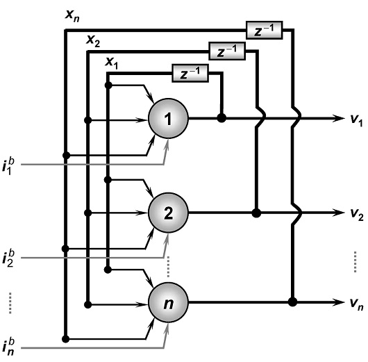

<h1>redeHopfield</h1>

Implementação da Rede Neural de Hopfield proposta no Projeto prático 7.8 do livro "Redes Neurais Arficiais para engenharia e ciências aplicadas" do autor Ivan Nunes da Silva.

<h4>
Aluno: Jônatas Trabuco Belotti 
Email: jonatas.t.belotti@hotmail.com
</h4>

<h2>Arquitetura da rede</h2>

A rede possui 45 entradas entradas e 45 neurônios em sua única camada neural.
A função de ativação de todos os neurônios é a função sinal.
Conforme a imagem a seguir.

<h2>Arquivos</h2>

Os arquivos do repositórios são:

<b>Pasta "redeHopfield" - </b> Contém o projeto do NetBeans com a implementação da rede de Hopfield em Java.

<b>Arquivo "redeHopfield.exe" - </b> Arquivo executavel da rede para ser executado em Windows.

<b>Arquivo "redeHopfield.jar" - </b> JAR da rede para ser executado em linux ou Windows.

<b>Arquivo "Relatorio.pdf" - </b> Arquivo PDF contendo o relatório entregue para a diciplina.

<b>Atenção - </b> para executar os arquivos "redeHopfield.jar" ou "redeHopfield.exe" é necessário ter o <a target="_blank" href="https://www.java.com/pt_BR/download/">Java JRE</a> ou <a target="_blank" href="http://www.oracle.com/technetwork/pt/java/javase/downloads/index.html">Java JDK</a> instalado em seu computador.
